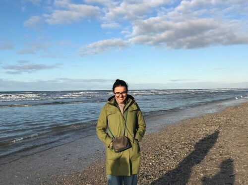

*(Zandvoort beach, December, 2022)*

I am a PhD student in the department of Linguistics at the [English and Foreign Languages University](http://www.efluniversity.ac.in/), Hyderabad, India. Before that I did my Masters in Linguistics from [Jawaharlal Nehru University](https://www.jnu.ac.in/main/), New Delhi. 

My passion for Linguistics started when I discovered the field during my undergraduate study in English. Since then, I have explored various areas of Linguistics and currently have reached a point where I am utterly curious to know more about the interface between language and the general human cognition, and also how they mutually aid each other in their development.
